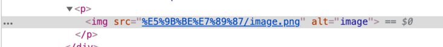
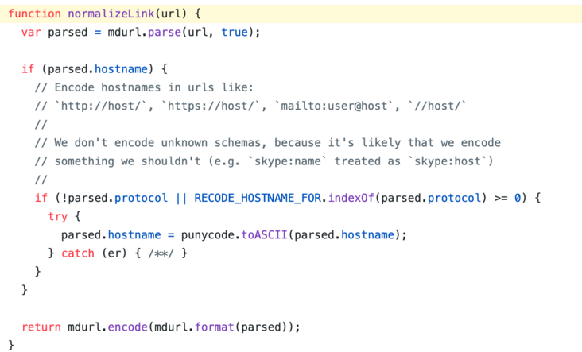
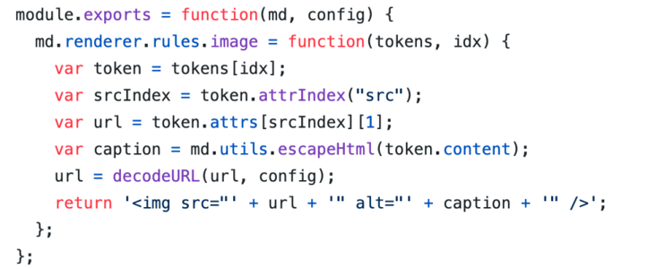

<!-- more -->

## 不会出现图片无法加载的情况

+ 图片资源路径如果不是英文
+ 图片资源是相对(短)路径(不以 ./ ../开始 )

## 问题描述

+ Vuepress 本身使用的是 webpack
+ 图片引用使用的应该是 url-loader/file-loader
+ *.md 文件的编译使用的是 markdown-it

1. 如果图片资源的引用是使用 url-loader , 那么短路径访问的就不再是相对路径,而是 node_modules 目录下资源.所以,在 vuepress 中的路径资源必须是以 ./ or ../开始
2. markdown-it 会对路径做一个encode 操作, 具体转换由 mdurl 执行





https://github.com/markdown-it/markdown-it/blob/575cfeab8acd2d59d637e856d3a205c6e81419cb/lib/index.js#L47


编写markdown-it插件




## 解决方案
```javascript
npm i markdown-it-disable-url-encode
```

将其注入vuepress 配置文件中
vuepress/config.js
```javascript
module.exports = {
  // .....
  markdown: {
    // ......
    extendMarkdown: md => {
      md.use(require("markdown-it-disable-url-encode"));
    }
  }
};
```